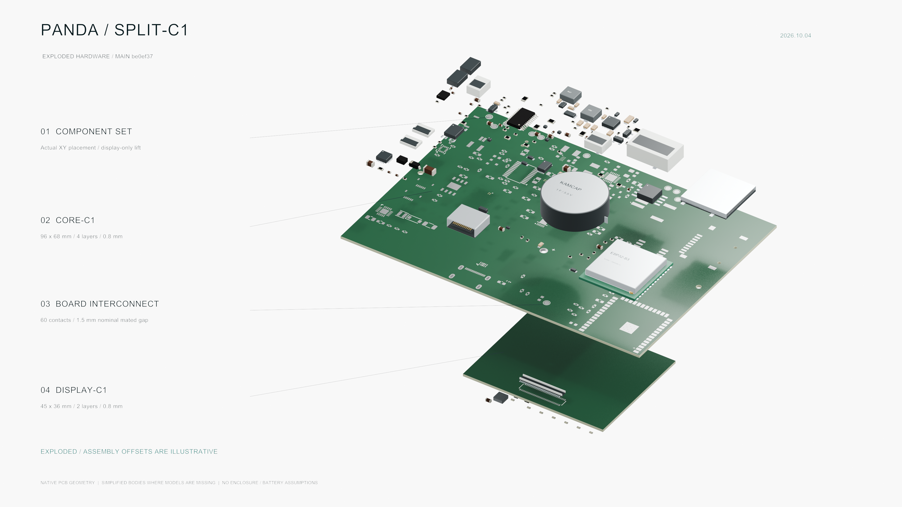

# Panda Split-C1 — 最新雙板爆炸圖與視頻

硬體來源：`be0ef37235587d78aba5297be04617422bf1b670`，不是 Thin7／R2 或舊整合板。

[播放／下載 20 秒視頻](Panda-Split-C1-Exploded-1080p.mp4) · [4K 爆炸圖](Panda-Split-C1-Exploded-4K.png) · [4K 底面圖](Panda-Split-C1-Underside-4K.png) · [4K 組裝圖](Panda-Split-C1-Assembled-4K.png)

視頻：1920 × 1080、24 fps、20 秒、H.264、無音軌；組裝 → 展開 → 底面環繞 → 合攏。靜態圖：3840 × 2160 PNG。

## 來源與範圍

PCB、銅箔、焊盤、孔位及元件 XY 位置來自 KiCad 10.0.5 原生 GLB 匯出。Core 為 96 × 68 mm／4 層／0.8 mm；Display 為 45 × 36 mm／2 層／0.8 mm，採用專案已核對的板間變換。組裝狀態使用 1.5 mm 名義板間距；展開距離只是為了看清組件，不是尺寸或裝配公差。

場景顯示 161 個板上裝配位號（Core 124、Display 37）；板外 TH301 不在場景內。110 個位號使用專案已指派的 KiCad 通用模型，51 個缺少可用模型的位號以實際位置、封裝外形／高度資料建立簡化實體。通用模型及簡化實體均不等同於原廠精密零件模型。各位號清單、原始 CAD SHA-256 及板間變換見 `render-provenance.json`。

沒有加入尚未核准的外殼、電池、面板或 FPC，也没有修改 PCB。視覺化不代表機構碰撞、製造、供料、散熱或實板性能已通過。

## 可編輯場景

`Panda-Split-C1-be0ef37.blend` 包含幾何、材質、相機及 480 幀動畫。Blender 5.2.1 LTS；第 1 幀為組裝、第 181 幀為正面爆炸、第 365 幀為底面。系統字體只保留引用，沒有打包或提供字體文件；跨平台可改用本機字體。`render_saved_scene.py` 可重新渲染保存場景。

原生幾何來自本倉庫；通用零件可視模型來自已安裝的 KiCad 3D 模型庫。這不是新原廠 STEP 模型的發佈。檔案完整性見 `SHA256SUMS`。
